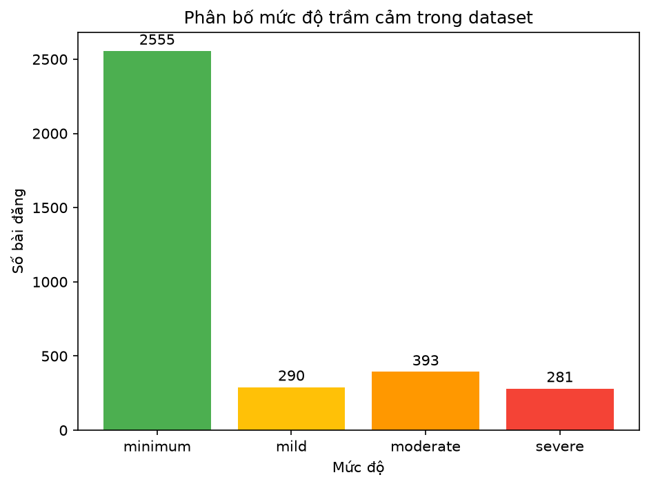
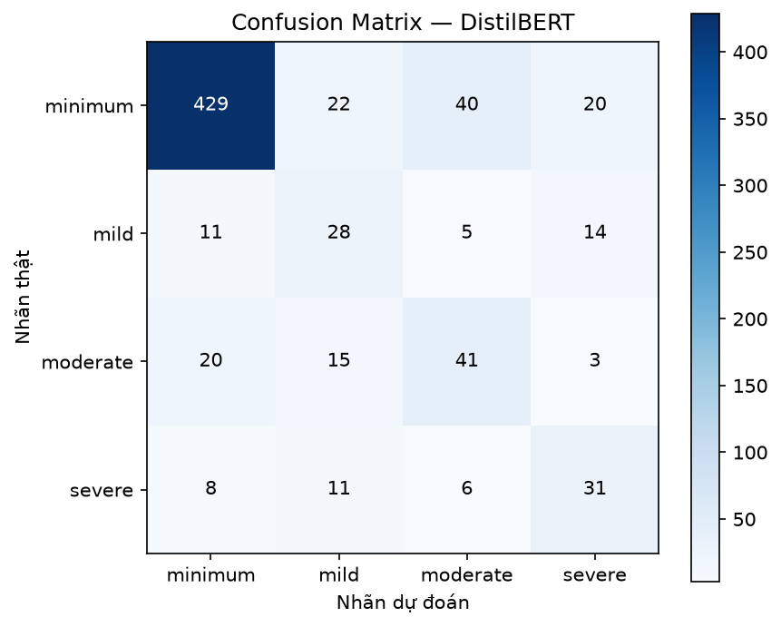

# Depression Severity Classification

Dự án bài tập lớn môn **Học máy**, xây dựng hệ thống phân loại mức độ trầm cảm từ bài đăng Reddit tiếng Anh. Bài toán gồm bốn nhãn có thứ tự:

```text
minimum (0) < mild (1) < moderate (2) < severe (3)
```

## Thành viên nhóm

| Thành viên | MSSV |
|---|---|
| Vũ Minh Thư | 24100446 |
| Nguyễn Thị Thanh Huệ | 24100162 |
| Nguyễn Đình Quyền | 24100159 |
| Tô Xuân Thảo | 24107885 |

Dự án triển khai năm mô hình: Logistic Regression, SVM, XGBoost, BiLSTM và DistilBERT. Ngoài huấn luyện và đánh giá mô hình, repository còn có EDA, feature importance, phân tích lỗi, LIME và Web Demo bằng Flask.

> Dự án chỉ phục vụ mục đích học tập và nghiên cứu. Kết quả dự đoán không phải chẩn đoán y khoa.

## Tính năng chính

- Làm sạch dữ liệu và kiểm tra trùng lặp.
- Phân tích dữ liệu thiếu và outlier độ dài văn bản.
- Biểu diễn TF-IDF, TruncatedSVD và bảy đặc trưng thủ công.
- Huấn luyện năm mô hình trên cùng cách chia dữ liệu.
- Tuning tối thiểu cho DistilBERT.
- Repeated Stratified Holdout với ba seed.
- Stratified 3-Fold cho DistilBERT.
- Feature importance, error analysis và LIME.
- Web Demo với API `/predict` và `/explain`.

## Dữ liệu

Dữ liệu sau làm sạch có **3.519 bài đăng**:

| Nhãn | Số mẫu | Tỷ lệ |
|---|---:|---:|
| Minimum | 2.555 | 72,61% |
| Mild | 290 | 8,24% |
| Moderate | 393 | 11,17% |
| Severe | 281 | 7,99% |

File đầu vào chính:

```text
data/processed/depression_severity_preprocessed.csv
```

Các cột được sử dụng:

| Cột | Mô tả |
|---|---|
| `text` | Văn bản gốc |
| `label` | Nhãn dạng chuỗi |
| `text_classical` | Văn bản cho các mô hình truyền thống |
| `text_neural` | Văn bản cho BiLSTM và DistilBERT |

Kết quả kiểm tra dữ liệu:

- Không có giá trị thiếu hoặc văn bản rỗng.
- Không còn nội dung trùng chính xác.
- Có 112 bài đăng được đánh dấu là outlier độ dài theo IQR.
- Các outlier được giữ lại để tránh làm mất thông tin có giá trị.



## Mô hình

| Mô hình | Đầu vào |
|---|---|
| Logistic Regression | TF-IDF unigram và bigram |
| SVM | TF-IDF unigram và bigram |
| XGBoost | 300 thành phần SVD và 7 đặc trưng thủ công |
| BiLSTM | Token ID và embedding học được |
| DistilBERT | WordPiece từ `distilbert-base-uncased` |

Cấu hình TF-IDF:

```text
max_features = 3000
ngram_range  = (1, 2)
min_df       = 2
max_df       = 0.9
```

Cấu hình DistilBERT được chọn sau tuning:

```text
max_length        = 150
batch_size        = 8
epochs            = 3
learning_rate     = 3e-5
weight_decay      = 0.01
warmup_ratio      = 0.1
gradient_clip     = 1.0
```

## Kết quả benchmark

Benchmark sử dụng Repeated Stratified Holdout với ba seed `42`, `52`, `62`. Mỗi lần chia giữ 20% dữ liệu làm tập test. Trong cùng một seed, năm mô hình sử dụng chung chỉ số train/test.

| Mô hình | Accuracy | Macro-F1 | QWK |
|---|---:|---:|---:|
| Logistic Regression | 0,6596 ± 0,0165 | 0,4427 ± 0,0217 | 0,3729 ± 0,0419 |
| SVM | 0,6638 ± 0,0185 | 0,4436 ± 0,0222 | 0,3782 ± 0,0388 |
| XGBoost | 0,6700 ± 0,0116 | 0,4048 ± 0,0112 | 0,3459 ± 0,0384 |
| BiLSTM | 0,5535 ± 0,0406 | 0,3188 ± 0,0160 | 0,2134 ± 0,0403 |
| **DistilBERT** | **0,7249 ± 0,0295** | **0,5331 ± 0,0429** | **0,4794 ± 0,0617** |

File tổng hợp:

```text
outputs/reports/unified_repeated_holdout_summary.csv
```

Kết quả Stratified 3-Fold của DistilBERT:

| Chỉ số | Mean ± Std |
|---|---:|
| Accuracy | 0,7218 ± 0,0160 |
| Macro-F1 | 0,5301 ± 0,0052 |
| QWK | 0,4602 ± 0,0088 |



## Cấu trúc thư mục

```text
depression_severity_project/
├── data/
│   ├── raw/
│   └── processed/
├── models/
│   ├── distilbert_model/
│   └── distilbert_model_tuned/
├── notebooks/
├── outputs/
│   ├── figures/
│   └── reports/
├── src/
├── web/
│   ├── backend/
│   └── frontend/
├── requirements.txt
└── README.md
```

Các script chính:

| File | Chức năng |
|---|---|
| `src/data_quality_fairness.py` | Kiểm tra dữ liệu thiếu, outlier và performance slicing |
| `src/feature_selection_importance.py` | Feature selection và feature importance |
| `src/tune_distilbert.py` | Tuning DistilBERT |
| `src/run_unified_benchmark.py` | Benchmark năm mô hình |
| `src/evaluate_distilbert.py` | Repeated holdout hoặc K-Fold cho DistilBERT |

## Cài đặt

Python 3.11 được khuyến nghị.

### 1. Tạo môi trường ảo

**Git Bash:**

```bash
python -m venv .venv
source .venv/Scripts/activate
python -m pip install --upgrade pip
```

**PowerShell:**

```powershell
python -m venv .venv
.\.venv\Scripts\Activate.ps1
python -m pip install --upgrade pip
```

### 2. Cài thư viện

`requirements.txt` chứa toàn bộ thư viện dùng cho huấn luyện, notebook, LIME và Web Demo. PyTorch CPU được cài mặc định để môi trường nhẹ hơn bản CUDA.

```bash
python -m pip install --no-cache-dir -r requirements.txt
```

Kiểm tra PyTorch:

```bash
python -c "import torch; print('PyTorch:', torch.__version__); print('CUDA:', torch.cuda.is_available()); print('Thiết bị:', torch.cuda.get_device_name(0) if torch.cuda.is_available() else 'CPU')"
```

### 3. Chuyển sang GPU (không bắt buộc)

Sau khi đã cài `requirements.txt`, gỡ bản CPU và cài lại PyTorch theo CUDA phù hợp với máy. Ví dụ với CUDA 13.0:

```bash
python -m pip uninstall -y torch
python -m pip install --no-cache-dir torch \
  --index-url https://download.pytorch.org/whl/cu130
```

Kiểm tra lại:

```bash
python -c "import torch; print('PyTorch:', torch.__version__); print('CUDA build:', torch.version.cuda); print('CUDA available:', torch.cuda.is_available()); print('GPU:', torch.cuda.get_device_name(0) if torch.cuda.is_available() else 'CPU')"
```

Xóa cache cài đặt khi cần giải phóng dung lượng:

```bash
python -m pip cache purge
```

## Cách chạy

Các lệnh dưới đây được chạy tại thư mục gốc của dự án.

### Kiểm tra dữ liệu

```bash
python -X utf8 src/data_quality_fairness.py
```

### Feature selection và feature importance

```bash
python -X utf8 src/feature_selection_importance.py
```

### Tuning DistilBERT

```bash
python -X utf8 src/tune_distilbert.py --max-configs 2 --save-model
```

### Benchmark năm mô hình

```bash
python -X utf8 src/run_unified_benchmark.py \
  --seeds 42 52 62 \
  --models logreg svm xgboost bilstm distilbert
```

### Stratified 3-Fold cho DistilBERT

```bash
python -X utf8 src/evaluate_distilbert.py \
  --protocol kfold \
  --n-splits 3 \
  --seeds 42
```

### Phân tích lỗi

```bash
jupyter lab notebooks/11_error_analysis.ipynb
```

## Web Demo

Chạy backend:

```bash
cd web/backend
python app.py
```

Mở trình duyệt tại:

```text
http://127.0.0.1:5000
```

API:

| Method | Endpoint | Mô tả |
|---|---|---|
| `GET` | `/` | Giao diện Web |
| `POST` | `/predict` | Dự đoán mức độ |
| `POST` | `/explain` | Giải thích cục bộ bằng LIME |

Ví dụ request cho `/predict`:

```json
{
  "text": "I have been feeling exhausted and hopeless for weeks."
}
```

Backend mặc định sử dụng mô hình:

```text
models/distilbert_model_tuned/
```

## File kết quả chính

```text
outputs/reports/unified_repeated_holdout_summary.csv
outputs/reports/unified_repeated_holdout_metrics.csv
outputs/reports/unified_repeated_holdout_predictions.csv
outputs/reports/distilbert_tuning_results.csv
outputs/reports/distilbert_kfold_summary.csv
outputs/reports/data_quality_fairness_report.md
outputs/reports/feature_selection_and_importance.md
```

## Kiểm thử và pipeline tổng hợp

Chạy kiểm thử các hàm cöt lõi:

```bash
python -m unittest discover -s tests -v
```

Chạy kiểm tra dữ liệu và phân tích đặc trưng:

```bash
python scripts/run_all.py
```

Thêm `--benchmark` để chạy benchmark đầy đủ. Kết quả được lưu trong `outputs/reports/`.
Macro-F1 baseline XGBoost (ví dụ `0.4254`) chỉ là mốc so sánh, không phải kết quả tốt nhất của toàn hệ thống.


## Ghi chú

- Tập dữ liệu mất cân bằng mạnh nên Macro-F1 và QWK được ưu tiên hơn Accuracy.
- Tuning hiện thử hai cấu hình DistilBERT.
- Repeated holdout sử dụng cấu hình cố định sau tuning; quy trình này chưa phải nested cross-validation.
- Dữ liệu không có thông tin nhân khẩu học nên chưa thể đánh giá fairness theo giới tính, tuổi hoặc khu vực.
- Kết quả trên GPU có thể dao động nhẹ do một số phép toán CUDA không hoàn toàn deterministic.
- Mô hình không thay thế đánh giá của bác sĩ hoặc chuyên gia tâm lý.
